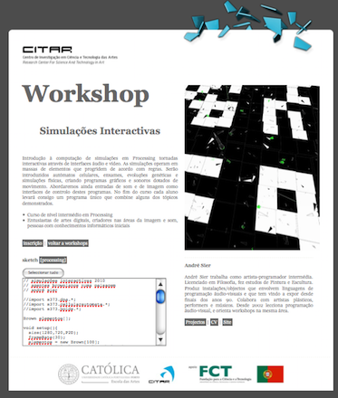

##Wks Simulações Interactivas 
#####André Sier
22, 23 e 24 Novembro 2010 [10:00 – 17:30] @ ucp.pt

este repositório contém os ficheiros iniciais do workshop Simulações Interactivas leccionado em 2010 em Processing na Universidade Católica Portuguesa (ucp.pt) por André Sier, disponibilizados open source através de licensa MIT. Para mais informações sobre a licensa consultar o documento COPYING.

######Wks Simulações Interactivas (descrição)

	Introdução à computação de simulações em Processing tornadas
	 interactivas através de interfaces áudio e vídeo. As simulações
	 operam em massas de elementos que progridem de acordo com regras.
	 Serão introduzidos autómatos celulares, enxames, evoluções
	 genéticas e simulações físicas, criando programas gráficos e
	 sonoros dotados de movimento. Abordaremos ainda entradas de som e
	 de imagem como interfaces de controlo destes programas. No fim do 
	 curso cada aluno levará consigo um programa único que combine 
	 alguns dos tópicos demonstrados.

	Curso de nível intermédio em Processing

	Entusiastas de artes digitais, criadores nas áreas da imagem e som,
	pessoas com conhecimentos informáticos iniciais

	Quando|Onde:
	10:00 – 13:00 | 14:30 – 17:30 @ Lab de Artes Digitais

######Wks Simulações Interactivas (instalação)
	1. instalar o Processing 1.5.1 ou superior
	2. localizar a directoria do *sketchbook* (processing->file->preferences
	 : a directoria está seleccionada no campo sketchbook folder :
	  normalmente é UserName/Documents/Processing)
	3. deszipar as libraries deste workshop para a pasta libraries do sketchbook, ie, 
		wkssimulinter/libraries/*  --> sketchbook/libraries
	(se a pasta libraries não existir basta criá-la)
	4. copiar a pasta 'WksSimulacoesInteractivas' para o sketchbook
	 (para abrir os exemplos do workshop através de 
	 processing->file->sketchbook) 

######Wks Simulações Interactivas (árvore do workshop)

	├── si_dia1
	│   ├── _audio
	│   │   ├── _3daudiospectrum1a
	│   │   │   └── _3daudiospectrum1a.pde
	│   │   ├── sistemas_de_particulas_som
	│   │   │   ├── Part.pde
	│   │   │   ├── SysPart.pde
	│   │   │   └── sistemas_de_particulas_som.pde
	│   │   ├── snd_tri
	│   │   │   └── snd_tri.pde
	│   │   ├── snd_tri_humans
	│   │   │   ├── Images.pde
	│   │   │   ├── data
	│   │   │   │   └── humanmasks
	│   │   │   │       ├── h1.jpg
	│   │   │   │       ├── h2.jpg
	│   │   │   │       ├── h3.jpg
	│   │   │   │       ├── h4.jpg
	│   │   │   │       ├── h5.jpg
	│   │   │   │       ├── h6.jpg
	│   │   │   │       ├── h7.jpg
	│   │   │   │       ├── h8.jpg
	│   │   │   │       ├── m1.jpg
	│   │   │   │       ├── m2.jpg
	│   │   │   │       ├── m3.jpg
	│   │   │   │       ├── m4.jpg
	│   │   │   │       ├── m5.jpg
	│   │   │   │       ├── m6.jpg
	│   │   │   │       ├── m7.jpg
	│   │   │   │       └── m8.jpg
	│   │   │   ├── sndTri.pde
	│   │   │   └── snd_tri_humans.pde
	│   │   └── snd_tri_orient
	│   │       ├── Goodies.pde
	│   │       └── snd_tri_orient.pde
	│   ├── _video
	│   │   ├── flob_collide
	│   │   │   ├── bola.pde
	│   │   │   └── flob_collide.pde
	│   │   ├── flob_parts
	│   │   │   ├── PSys.pde
	│   │   │   └── flob_parts.pde
	│   │   ├── hello_flob
	│   │   │   └── hello_flob.pde
	│   │   ├── monoflob
	│   │   │   ├── _Monoflob.pde
	│   │   │   ├── botao.pde
	│   │   │   └── monoflob.pde
	│   │   ├── noisepartsfield_video_cor
	│   │   │   ├── Particle.pde
	│   │   │   ├── ParticleSystem.pde
	│   │   │   └── noisepartsfield_video_cor.pde
	│   │   ├── parts_videoflob_arraylist
	│   │   │   ├── Part.pde
	│   │   │   └── parts_videoflob_arraylist.pde
	│   │   ├── parts_videoflob_arraylist_gl
	│   │   │   ├── Part.pde
	│   │   │   └── parts_videoflob_arraylist_gl.pde
	│   │   ├── time_rain_2_delay
	│   │   │   ├── plane.pde
	│   │   │   └── time_rain_2_delay.pde
	│   │   └── video_delay
	│   │       └── video_delay.pde
	│   ├── si_2dca
	│   │   └── si_2dca.pde
	│   ├── si_2dca_life
	│   │   └── si_2dca_life.pde
	│   ├── si_dna_linhas
	│   │   ├── LineAgent.pde
	│   │   └── si_dna_linhas.pde
	│   ├── si_dna_string
	│   │   └── si_dna_string.pde
	│   ├── si_elementos_brownianos
	│   │   └── si_elementos_brownianos.pde
	│   ├── si_flock2d
	│   │   └── si_flock2d.pde
	│   ├── si_flock2d_attrpts
	│   │   └── si_flock2d_attrpts.pde
	│   ├── si_flock3d_attrpts
	│   │   └── si_flock3d_attrpts.pde
	│   ├── si_lineinvaders_invasores
	│   │   ├── Explo.pde
	│   │   ├── Hero.pde
	│   │   ├── InvaderSmall.pde
	│   │   ├── InvadersGenerator.pde
	│   │   ├── Snd.pde
	│   │   ├── Tiros.pde
	│   │   ├── data
	│   │   │   ├── Beatbox-10.vlw
	│   │   │   ├── Beatbox-12.vlw
	│   │   │   ├── Beatbox-14.vlw
	│   │   │   ├── Beatbox-40.vlw
	│   │   │   ├── blast.aiff
	│   │   │   ├── gameover.aiff
	│   │   │   └── shot.aiff
	│   │   └── si_lineinvaders_invasores.pde
	│   ├── si_pang2b
	│   │   ├── Balls.pde
	│   │   ├── Obs.pde
	│   │   ├── heroi.pde
	│   │   ├── si_pang2b.pde
	│   │   └── tiros.pde
	│   ├── si_physis_agregados
	│   │   ├── Physis.pde
	│   │   └── si_physis_agregados.pde
	│   ├── si_physis_agregadoscollide
	│   │   ├── Physis.pde
	│   │   └── si_physis_agregadoscollide.pde
	│   ├── si_statemachine_float
	│   │   ├── BinaryMachine.pde
	│   │   ├── FloatMachine.pde
	│   │   └── si_statemachine_float.pde
	│   └── si_wargames
	│       ├── Explosoes.pde
	│       ├── Fogo.pde
	│       ├── airborn.pde
	│       ├── atmosphere.pde
	│       ├── data
	│       │   ├── Night.jpg
	│       │   ├── cities.txt
	│       │   ├── ee2048a.png
	│       │   └── eee2048a.png
	│       ├── si_wargames.pde
	│       └── worldcities.pde
	├── si_dia2
	│   ├── faces
	│   │   ├── Button.pde
	│   │   ├── DNA.pde
	│   │   ├── Face.pde
	│   │   ├── Population.pde
	│   │   ├── data
	│   │   │   └── GillSans-12.vlw
	│   │   └── faces.pde
	│   ├── si_ca1d
	│   │   └── si_ca1d.pde
	│   ├── si_ca1d_sound
	│   │   └── si_ca1d_sound.pde
	│   ├── si_ca2d
	│   │   └── si_ca2d.pde
	│   ├── si_flock2d_video
	│   │   └── si_flock2d_video.pde
	│   ├── si_lineinvaders_flock
	│   │   ├── Invader.pde
	│   │   ├── InvaderAgent.pde
	│   │   └── si_lineinvaders_flock.pde
	│   └── si_pathfollowing2
	│       ├── boid.pde
	│       ├── path.pde
	│       └── si_pathfollowing2.pde
	├── si_dia3
	│   ├── si_flock3d_attrpts_video
	│   │   └── si_flock3d_attrpts_video.pde
	│   └── si_galaxy_2a
	│       ├── Galaxy.pde
	│       ├── Star.pde
	│       └── si_galaxy_2a.pde
	└── wks-simulacoes-interactivas.png

	100 directories, 261 files

######Wks Simulações Interactivas (licensa+(c))
Copyright 2010 [André Sier](http://andre-sier.com) 

Licensed under the terms of the MIT License, available in the file COPYING

######Wks Simulações Interactivas (prefácio)

	// simulações interactivas 2010
    // agentes brownianos numa paisagem
    // andré sier

    import s373.dna.*; 
    import s373.cellularautomata.*; 
    import s373.boids.*;

    Brown elementos[];

    void setup(){
      size(1280,720,P2D);
      frameRate(30);
      elementos = new Brown[100];
      for(int i=0;i<elementos.length;i++){
        elementos[i] = new Brown();
      }   
      background(225);
    }

    void draw(){  
      for(int i=0;i<elementos.length;i++){
        elementos[i].go();
      }   
      for(int i=0;i<elementos.length;i++){
        for(int j=i+1; j<elementos.length;j++) {      
            elementos[i].touch( elementos[j] );
        }
      }   
    }

    float dev = 0.7;
    float ms = 2.73;
    float distmax = 100*100;

    class Brown{
       float x,y,vx,vy;
       int cor, touch;   
       Brown(){
         x = random(width);
         y = random(height);
         cor = random(1)<0.5 ?  0 :  255;
       }
       void go(){
          touch = 10;
          vx = constrain(vx+random(-dev,dev),-ms,ms); 
          vy = constrain(vy+random(-dev,dev),-ms,ms);   
          x += vx;
          y += vy;
          if(x<0) x+=width;
          if(x>width) x+=-width;
          if(y<0) y+=height;
          if(y>height) y+=-height;
          stroke(cor,150);
          point(x,y);
       }  
       void touch(Brown b) {
          float dx = b.x - x;
          float dy = b.y - y;
          float d = dx*dx+dy*dy;      
          if(d < distmax){
            stroke(b.cor, touch);
            line( b.x, b.y, x, y);      
            touch+=15;
          }   
       }   
    }

